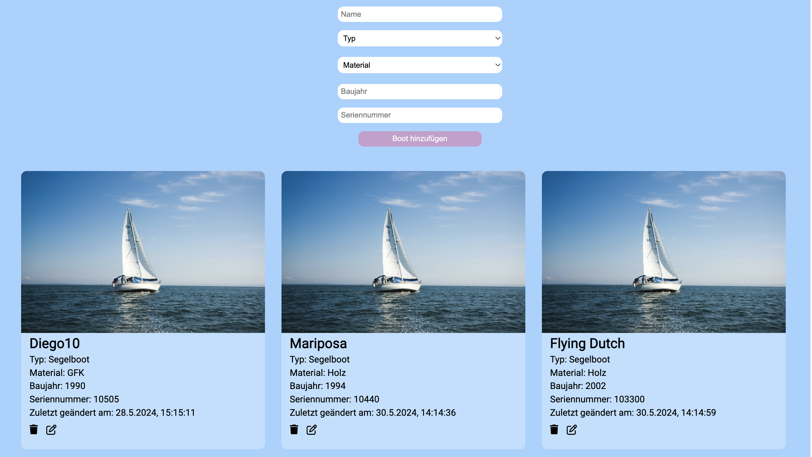
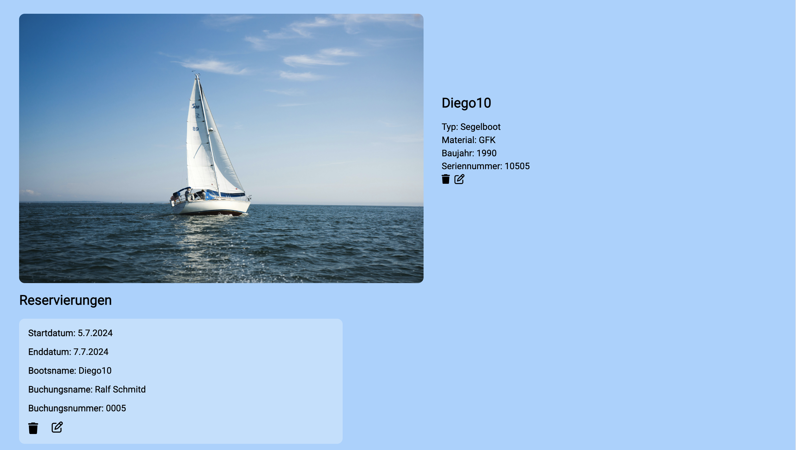
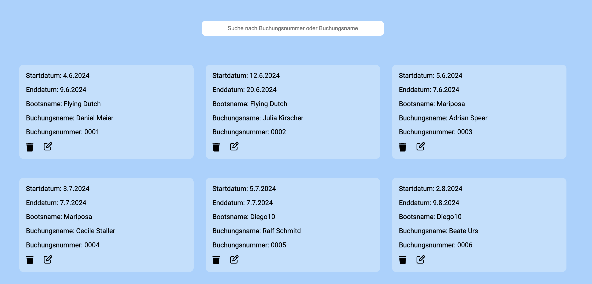
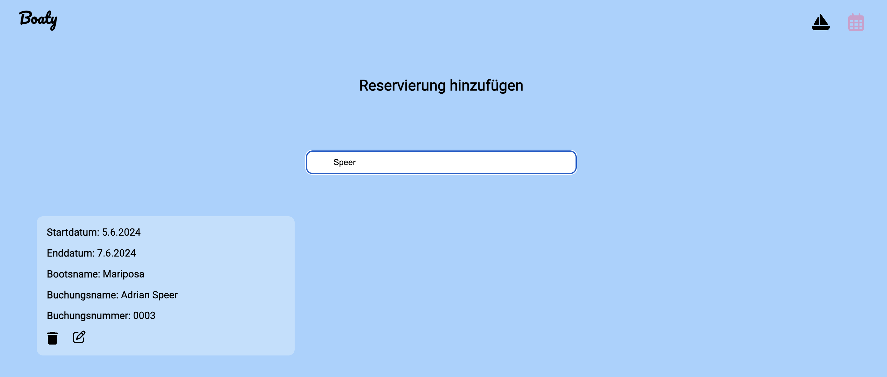

# Fullstack-Project: Bootsverleih-Boaty

## How does Bootsverleih-Boaty work? ⚙️

Boaty is a management software for boat rental companies.

- add boats to the database
- edit and delete boats
- add reservations
- edit and delete reservations
- search for reservations by booking number or nam
- dashboard with overview of reservations and boats

## Demo

https://boaty-frontend.onrender.com

## Screenshots 📸

## Copatible Screensizes 🖥️

- optimized for Desktops

## Tech Stack 💻

- React.js
- Vite
- VS Code
- HTML
- CSS
- JavaScript
- Git
- Node.js
- Express.js
- MongoDB
- mongoose
- Trello
